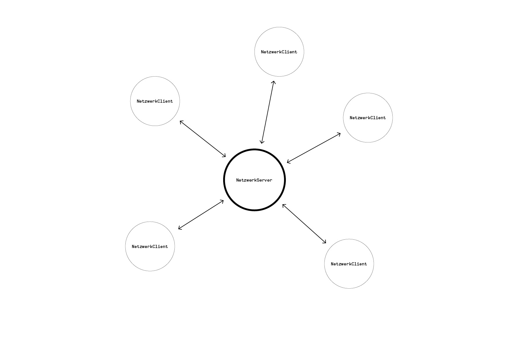
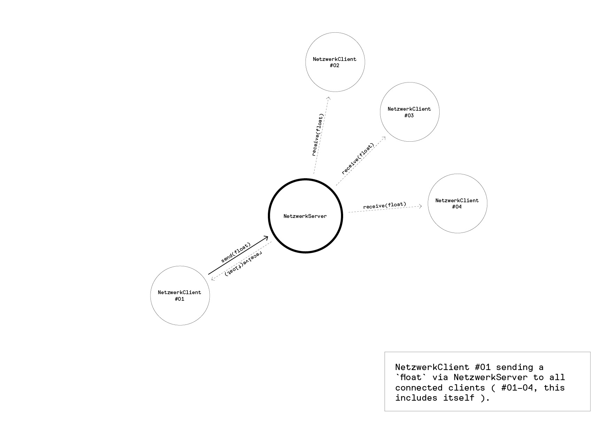

# netzwerk

*netzwerk* is a star-shaped network library build onto of [Open Sound Control](https://en.wikipedia.org/wiki/Open_Sound_Control) (OSC) to send simple messages from one client to many.

at the center of the library is a broadcasting server ( `NetzwerkServer` ) to which clients ( `NetzwerkClient` ) can connect. once connected a client can send messages to the server which will then be broadcasted to all connected clients ( including the sending client itself ).

## instructions

- run server `NetzwerkServer` ( e.g `AppBroadcastingServer` )
- create client `NetzwerkClient`
    - specify server name or IP
    - specify sender name
- connect to server with `connect()`
- send messages via `send()`
    - message is sent to server
    - server relays message to all connected clients ( incl oneself )
- receive messages via `receive()`
    - if method is implemented in sketch it get s called automatically when a message is received
    - note that the method gets called asynchron i.e the instant the message arrives; similarly to a key stroke. this can cause unwanted behavior, especially when adding to or removing elements from collection classes ( e.g `ArrayList` or `Vector` ); watch out for `ConcurrentModificationException`.

## message types

there are 4 different types of messages. all four messages contain a *sender*, a *tag*, and a *data* section. the *sender* is automatically added, the *tag* is specified when the message is sent, and the *data* is either comprised of 1, 2, or 3 floats or a String.

    /sender/tag/float
    /sender/tag/float,float
    /sender/tag/float,float,float
    /sender/tag/String

- *sender* is specified when `NetzwerkClient` is created
- *tag* is specified when a message is sent
- *data* section is specified as 1, 2, or 3 floats, or as a String

an example message could look like this:

    /dennis/random/0.25

### sending messages

messages are sent with `send` methods of which there are 4 variations, where the first argument `String` specifies the *tag*:

    send(String tag, float data)
    send(String tag, float data0, float data1)
    send(String tag, float data0, float data1, float data2)
    send(String tag, String data)

### receiving messages

analogously there are 4 variations of `receive` methods, where the first argument `String` specifies the *sender* and the second sepcifies the *tag*:

    receive(String sender, String tag, float data)
    receive(String sender, String tag, float data0, float data1)
    receive(String sender, String tag, float data0, float data1, float data2)
    receive(String sender, String tag, String data)

### variations of send and receive methods

there are other methods for sending messages as well
  
    - `send_direct()` : sends a message directly to another client omitting the server.
    - `spoof()` : sends a message using another *sender*.
    - `sneak()` : sends a message only to *localhost* ( the client itself )
    - `send_raw()` : sends a raw OSC message
    - `receive_raw()` : receives a raw OSC message

## dependencies

- [oscP5](http://dm-hb.de/db)
- [controlP5](http://dm-hb.de/da)

## releases

### 20170218

- added + cleanded up examples
- added `send_direct()` to send messages directly to other clients without the need for a server
- added `ping()` to ping the server
- added `receive_raw()` + `send_raw()` to send and receive raw OSC messages
- updated documentation ( with graphics )

### 20170217

- intial release
- 

## feature request

- connect servers to other servers
- auto-connect client to server when sending first message
- @NetzwerkServer add timestamp and message_type ( broadcast, server ) to log
